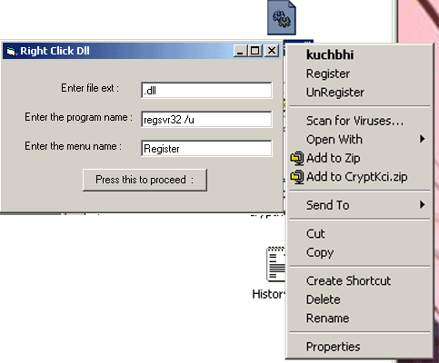



## RegisterDll,Ocx etc on Right Click :\)

### Description

This is very useful if you don't want to register each dll /ocx file using regsvr32 each time. Apart form this you can associate any file with any application using this and you will find the application if you right click over that file extension.Basically the same as my prev applications "Application on right click" but modified and prev are deleted.
 
### More Info
 
Pls read readme.txt file

To modify this you need to understand WIN API programming

Changes your registry so if improperly handled may fill your registry with garbage

No side effect detected still take care in filling data

             |
---                |---
**Submitted On**   |2002-03-21 09:31:18
**By**             |[HimanshuD](https://github.com/Planet-Source-Code/PSCIndex/blob/master/ByAuthor/himanshud.md)
**Level**          |Intermediate
**User Rating**    |5.0 (15 globes from 3 users)
**Compatibility**  |VB 5\.0, VB 6\.0
**Category**       |[Complete Applications](https://github.com/Planet-Source-Code/PSCIndex/blob/master/ByCategory/complete-applications__1-27.md)
**World**          |[Visual Basic](https://github.com/Planet-Source-Code/PSCIndex/blob/master/ByWorld/visual-basic.md)
**Archive File**   |[RegisterDl640233212002\.zip](https://github.com/Planet-Source-Code/himanshud-registerdll-ocx-etc-on-right-click__1-32915/archive/master.zip)

